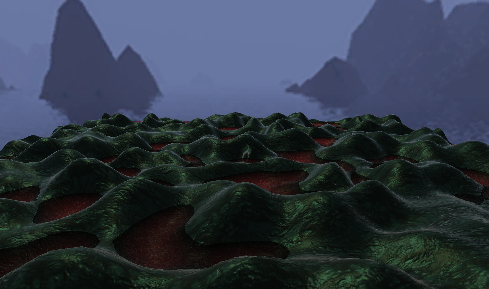

# CMPM-163-Final
## Collaborators:
	Alan Vasilkovsky - Terrain Generation & Controls
	Bradley Gallardo - Water & Caustics Effects
	
## Controls:
	Up/Down Arrows: Raise/Lower height of terrain
	Left/Right Arrows: Stretch/Squeeze terrain
	
## Screenshots:

#### Tall and Stretched Terrain

#### Low and Squeezed Terrain

#### Surface Caustics

#### Underwater Caustics

