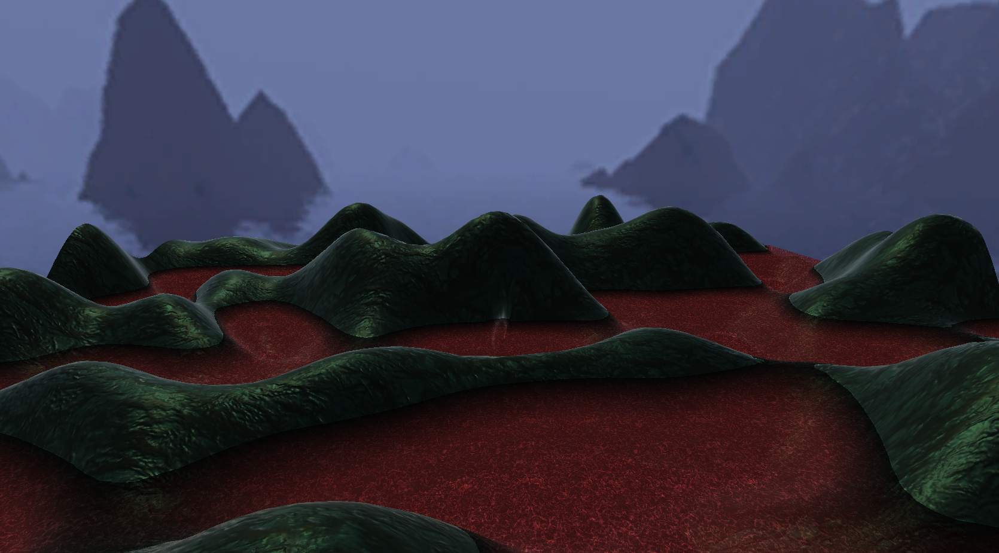

# CMPM-163-Final

A Unity project which uses terrain generation, volume rendered fog and water caustics to create a dreamy scene.

## Collaborators:
	Alan Vasilkovsky - Terrain Generation, Fog & Controls
	Bradley Gallardo - Water & Caustics Effects
	
## Links:
Video Overview: https://drive.google.com/open?id=1YznqxkWsThhipnv8VQ1KIGaWlMpHulWk

Final Build: https://drive.google.com/open?id=1-iut13TVoNetxPmjwGtL0spDmeRe-ITC
	
## Controls:
| Key        | Action           |
| ------------- |:-------------:|
| Arrow Keys / . / ,      | Move the terrain |
| W/S      | Increase/Decrease the height of the terrain      |
| D/A | Increase/Decrease the frequency of the terrain     |
	
## Screenshots:

#### Tall and Low Frequency Terrain

#### Short and High Frequency Terrain

#### Terrain with Fog

#### More Fog

#### Surface Caustics

#### Underwater Caustics

